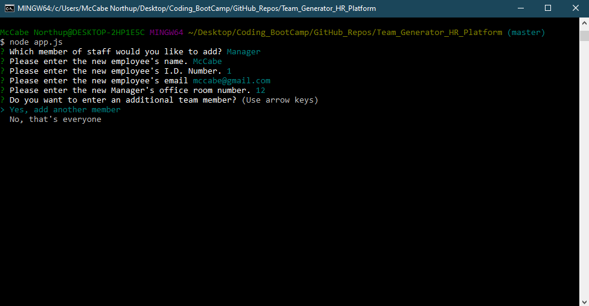

# Team Generator HR Platform

## Function 
- A command-line application that dynamically generates a HTML file that is compiled of all team members generated from the CLI.

- node app.js

## Intended Use
- This application is created with Human Resources or the hiring manager in mind. Quickly and efficiently a manager or director can build an HTML file with pertinent employee information, located in one location. 

## List of links/dependencies

inquirer-npm 
- https://www.npmjs.com/package/inquirer/v/0.2.3
fs-js
- https://www.npmjs.com/package/fs-js
path
- https://www.npmjs.com/package/path

## Credits
Used font awesome for the save icon.
https://fontawesome.com/license